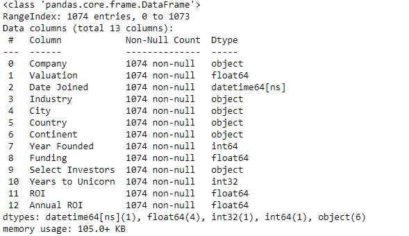
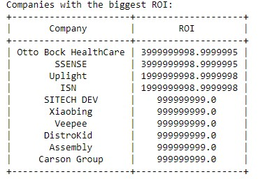
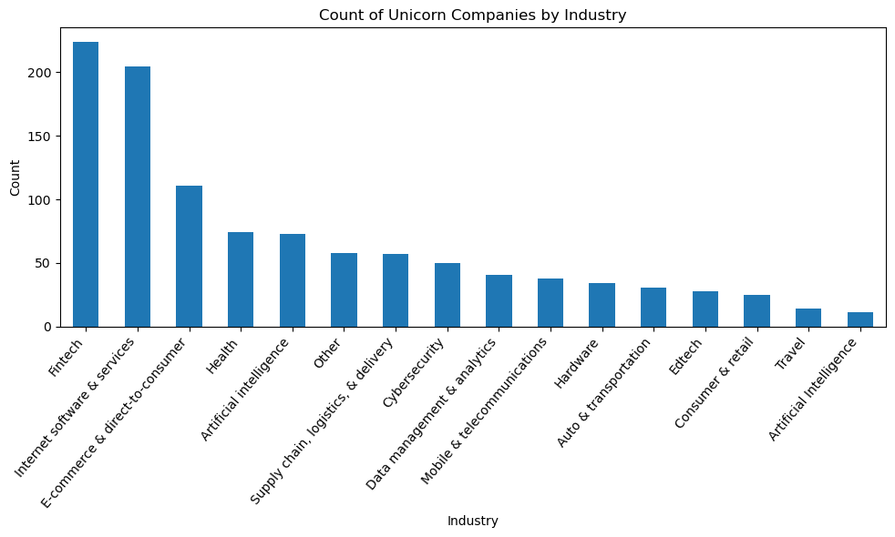
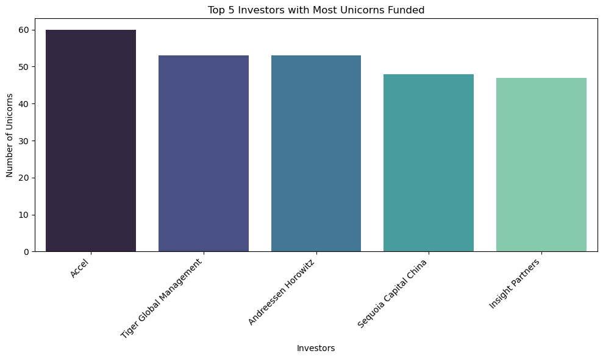
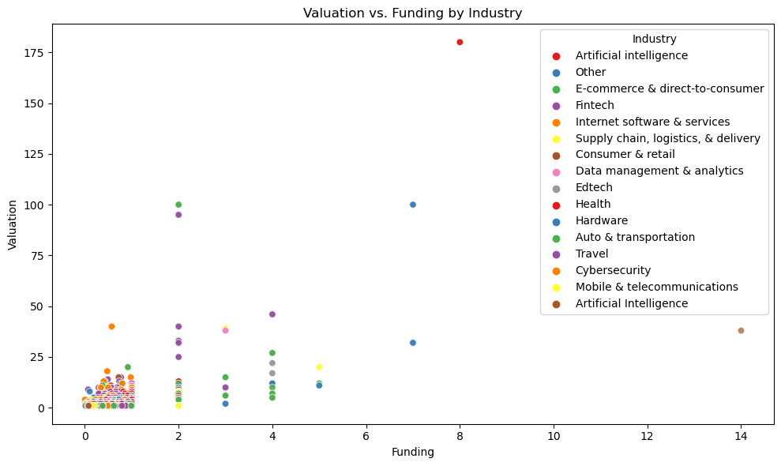
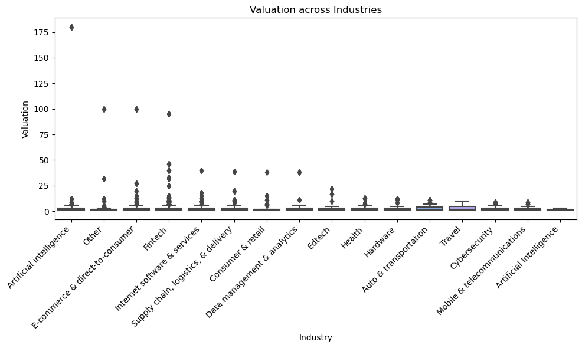
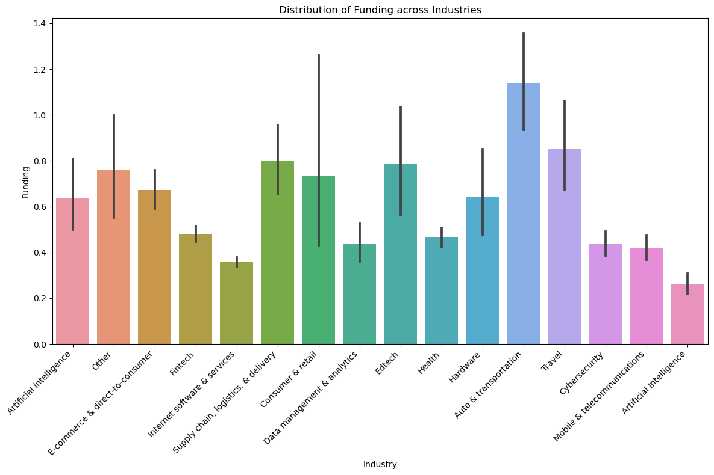
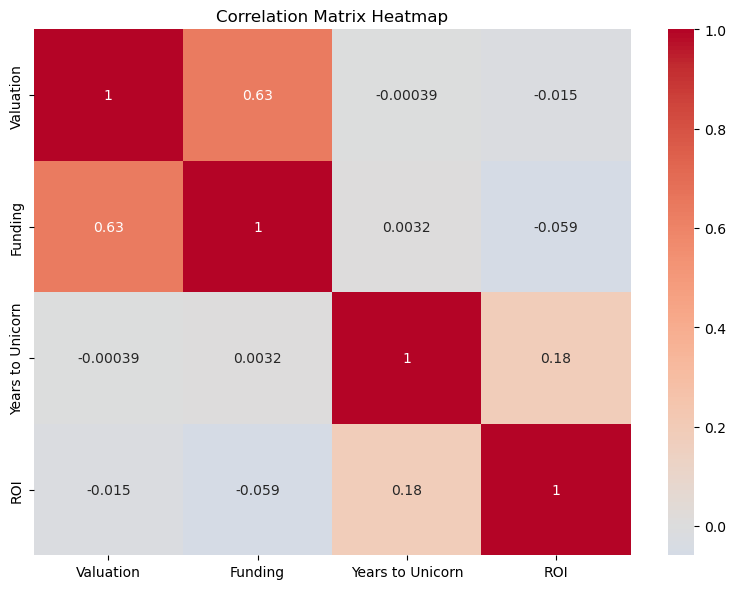

## Unicorn_Companies_Assignment - Quantum Analytics NG

#### INTRODUCTION:
This Project is a Python Assignment as part of the Data Analytics Fellowship programme of Quantum Analytics NG.
The data sets used was provided by Quantum Analytics NG and the data was for Unicorn Companies. The Unicorn Companies are Private companies with a valuation over $1 billion as of March 2022, including each company's current valuation, funding, country of origin, industry, select investors, and the years they were founded and became unicorns.

#### PROBLEM STATEMENT:
We are required to perform basic exploratory data analysis of the features of the Unicorn Companies dataset and come up with at least FOUR (4) data driven overall recommendations to help Unicorn Companies in creating good business models and making decisions that will focus on companies with high growth potential, diversify investment portfolio and prioritize companies with experienced leadership teams.

#### INITIAL DATA OBSERVATIONS:
1.  It was observed that there are 1074 total rows and 10 columns in the datasets
2.  There are 16 and 1 missing values in the "city" and "select Investors" column respectively.
3.  According to the data dictionary, the "Valuation" and "Funding" are supposed to be integers/float data data type and not object data type that it is.

#### DATA CLEANING, MANIPULATION, AND TRANSFORMATION:
To derive relevant and good insights from this data, there is a need for us to performe various data cleaning, manipulation and transformation such as;
- To convert "Valuation" and "Funding" columns data types from object to interger.
- To identify and replace missing/null values.
- There is need to convert the "date" column to "Datetime" and create a new column called "Years to Unicorn" which is the calculation of the year it takes a company to attain Unicorn stage.
- Merge the "Artificial Intelligence" industry that appeared twice together.

#### DATA ANALYTICS TOOL USED: PYTHON

#### ANALYSIS OBSERVATION:
**ANALYSIS 1** : Which unicorn companies have had the biggest return on investment?

**Otto Bock Healthcare and SSENSE are the companies with the biggest ROI**

**ANALYSIS 2**: What is the count of the Unicorn Companies by Industry?

**- The Fintech Industry has more Unicorns companies compare to other industry while the Artificial Intelligence industry appears to have the least. This is a growing industry and it is expected that this might change in the coming years.**

**- The top 5 industry with Unicorn Companies are Fintech, Internet Software & Services, E-commerce & Direct-to-Consumer, Health, and Artificial Intelligence and Investors are advised to look into any of these five industries for future investment decisions.**

**ANALYSIS 3**: Which countries have the most unicorns? Are there any cities that appear to be industry hubs?

**- The United States appears to be the country with the most Unicorns with 562 Unicorn Companies, followed by China with 173, India 65, United Kingdom 43, and Germany 26 to make the top five countries with highest Unicorn Companies.**

**- San Fransciso appears to be the city to be the industry hurb with an aggregate of 105 Unicorn Companies in the city spread across 4 industry (Internet software & services, Fintech, Consumer & Retail, and Supply chain, logistics, & delivery).**

**ANALYSIS 4:** Which investors have funded the most unicorns?

**ACCEL(60), Tiger Global Management(53), Andreessen Horowitz(53), Sequoia Capital China(48), and Insight Partners(47) are top 5 investors with the most funded record, i.e that has funded the most unicorns.**

**ANALYSIS 5:** Description of Valuation and Funding of Unicorn Companies by Industry

**The Artificial Intelligence Industry has the highest valuation by funding by industry relationship and this is shown in its USD180B valuation and USD8B funding received to far. At the bottom left of the plot is the concentration of various companies representing various industry making up the majority of companies with less than USD50B valuation and less than USD2B funding received so far.**

**ANALYSIS 6:** Description of Industry and Valuation

**It is observed also that the Artificial Intelligence Industry has the highest Valuation among other industries with USD180B valuation while the Mobile & Telecommunication has the lowest valuation figure of less than USD2B**

**ANALYSIS 7:** Description of Funding Vs Industry

**From the analysis, it is observed that the Auto and Trasportation Industry has received the highest funding so far followed by the Consumer Retail industry. The Internet Software services received the least funding so far**

**ANALYSIS 8:** Showing Correlation distribution of Valuation, Funding, Years to Unicorn and ROI

**From the analysis,we can conclude that there is a positive correlation between the Funding received and the valuation of each unicorn companies. Furthermore, it is observed that there is no correlation between Years it takes a company to become a unicorn and funding received as well as their valuation.**

#### CONCLUSION AND RECOMMENDATION:
- Investors can fund Unicorn Companies with Valuation above USD10B as this companies takes average of 6 years to attain Unicorn state.
- Investors can fund more Unicorns companies in the Fintech, Ecommerce and Cosumer Retail Industry as these industries appear to be doing great interms of average valuation.
- Unicorn companies in San Fransciso (USA) appears to be the bride of investors as this city is the industry hub for the top 5 unicorn company.
